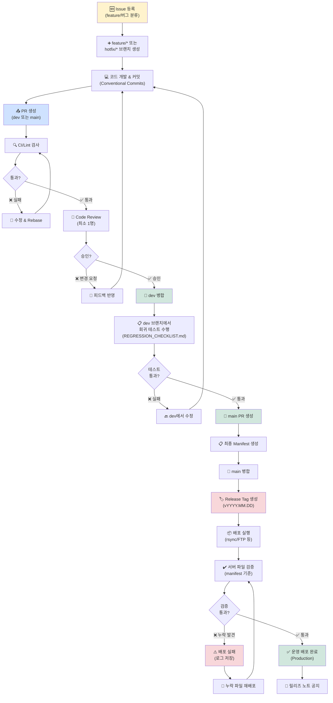

# THEK-NEXT MLM Platform - Workflow & Governance

---

## 📊 Issue → PR → Release 플로우 (Mermaid)



---

## 🏗️ 디렉토리 구조 & 파일 역할

```
thek-next (Repository Root)
│
├── .github/
│   ├── PULL_REQUEST_TEMPLATE.md      ← PR 템플릿 (체크리스트 포함)
│   └── workflows/                    ← GitHub Actions (향후)
│
├── docs/
│   ├── BRANCH_POLICY.md              ← 브랜치 & 동기화 정책
│   ├── DEPLOY.md                     ← 배포 절차 & Manifest
│   ├── REGRESSION_CHECKLIST.md       ← 배포 전 체크리스트
│   └── README.md                     ← 프로젝트 개요
│
├── includes/
│   ├── i18n.php                      ← 다국어 함수 (공통)
│   ├── gm_dashboard_ui.php           ← GM형식 CSS (공통)
│   └── db_connect.php                ← DB 연결 (공통)
│
├── lang/
│   ├── ko.php                        ← 한국어 (공통)
│   ├── ja.php                        ← 일본어 (공통)
│   └── en.php                        ← 영어 (공통)
│
├── _branches/
│   └── jp/                           ← JP 전용 로직/UI
│       ├── (JP 특화 파일)
│       └── includes/
│           └── gm_dashboard_ui.php   ← (공통과 동기화)
│
├── (root PHP files)
│   ├── gm_dashboard.php              ← GM 대시보드 라우터
│   ├── gm_dashboard_content.php      ← GM 대시보드 콘텐츠
│   ├── admin_dashboard.php
│   ├── admin_dashboard_content.php
│   └── ... (기타 대시보드 관련)
│
└── README.md                         ← 프로젝트 최상위 문서
```

---

## 📌 브랜치 네이밍 규칙

```
main                    운영 배포 기준 (브랜치 보호)
dev                     통합 개발 기준
feature/기능명-설명      신규 기능 (예: feature/gm-dashboard-layout)
hotfix/버그명-설명       긴급 수정 (예: hotfix/missing-lang-keys)
```

---

## 🔖 Release Tag 규칙

```
vYYYY.MM.DD             기본 형식 (예: v2026.01.18)
v2026.01.18-hotfix.1    핫픽스 (예: v2026.01.18-hotfix.1)
```

---

## 📝 Conventional Commits 규칙

```
feat:    신규 기능 (예: feat: add GM dashboard)
fix:     버그 수정 (예: fix: resolve lang key missing)
docs:    문서 수정 (예: docs: update BRANCH_POLICY.md)
style:   코드 스타일 (기능 무관)
refactor: 리팩토링 (기능 무관)
chore:   빌드/의존성 (예: chore: update CI config)
test:    테스트 추가 (예: test: add regression tests)
```

**예시 커밋 메시지**:
```
feat: add GM dashboard layout unification

- 모든 대시보드에 2열 그리드 적용
- 차트 높이 260px 통일
- 공통 CSS를 includes/gm_dashboard_ui.php로 분리

Closes #1
```

---

## 🎯 KO/JP 동기화 전략

### 공통 영역 (동시 반영)

```
/includes/     → 한 번 수정 → KO/JP 양쪽 반영
/lang/         → 한 번 수정 → KO/JP 양쪽 반영
/.github/      → 레포 정책 (공유)
/docs/         → 공문서 (공유)
```

**반영 절차**:
1. KO 기준으로 수정
2. JP 분기 동일 파일 확인
3. 회귀 테스트 (ko/ja/en)
4. PR 제출 시 양쪽 분기 명시

### JP 전용 영역

```
/_branches/jp/ → JP만 수정 (KO 영향 없음)
```

**단, include 함수 수정 시**: JP의 호출점도 테스트

---

## ⚙️ CI/CD 체크항목 (현재 수동 → 향후 자동화)

### 필수 체크 (모든 PR)

- [ ] 문법 에러 없음 (`get_errors`)
- [ ] Lint 통과
- [ ] 공통 파일 수정 시: KO/JP 동기화 확인

### main 병합 전 (데스크탑 확인)

- [ ] 회귀 테스트 (ko/ja/en)
- [ ] 대시보드 레이아웃 (GM 형식)
- [ ] 파일 누락/404

### 배포 전

- [ ] Manifest 생성 & 검증
- [ ] Release tag 준비

---

## 🔄 운영 절차 (Operations Guide)

> **이 섹션은 일상 개발/배포의 실행 가이드입니다.**  
> **정책/배경은 [BRANCH_POLICY.md](./BRANCH_POLICY.md) 참고**

### 📋 일반 개발 흐름 (feature)

```bash
# 1. feature 브랜치 생성
git checkout dev
git pull origin dev
git checkout -b feature/기능명

# 2. 개발 & 커밋 (Conventional Commits)
git add .
git commit -m "feat: 기능 설명"

# 3. dev로 PR 제출
git push origin feature/기능명
# → GitHub에서 PR 생성 (dev ← feature/기능명)

# 4. 코드 리뷰 + CI 통과 후 머지
# → Squash and merge 권장

# 5. 로컬 정리
git checkout dev
git pull origin dev
git branch -d feature/기능명
```

**체크포인트**:
- [ ] PR 템플릿 체크리스트 완료
- [ ] 코드 리뷰 승인 (최소 1명)
- [ ] CI/테스트 통과

### 🚨 긴급 수정 흐름 (hotfix)

```bash
# 1. main에서 hotfix 생성
git checkout main
git pull origin main
git checkout -b hotfix/버그명

# 2. 수정 & 커밋
git add .
git commit -m "fix: 긴급 버그 설명"

# 3. main과 dev에 동시 PR
git push origin hotfix/버그명
# → GitHub: main ← hotfix/버그명
# → GitHub: dev ← hotfix/버그명 (별도 PR)

# 4. 머지 후 정리
git checkout main
git pull origin main
git branch -d hotfix/버그명
```

**주의**: hotfix는 main과 dev 양쪽에 반영 필수!

### 🚀 운영 배포 흐름 (dev → main)

```bash
# 1. dev 브랜치에서 회귀 테스트 수행
- 언어 전환 (ko/ja/en) 정상 작동
- 주요 페이지 200 OK
- GM 대시보드 레이아웃 정상

# 2. main으로 PR 제출
git checkout dev
git pull origin dev
# → GitHub: main ← dev PR 생성

# 3. 회귀 체크리스트 완료 확인
- [ ] 공통 영역 (includes/, lang/) 테스트
- [ ] KO/JP 양쪽 정상 작동
- [ ] 파일 누락 없음

# 4. PR 머지 (Squash and merge)
# → main 브랜치 업데이트

# 5. 릴리즈 태그 생성
git checkout main
git pull origin main
git tag -a vYYYY.MM.DD -m "Release vYYYY.MM.DD"
git push origin vYYYY.MM.DD

# 6. GitHub Release 생성
# → Releases 탭에서 태그 선택
# → 릴리즈 노트 작성 (아래 템플릿 사용)
# → Publish release
```

---

## 🚨 문제 발생 시 대응

### 배포 후 버그 발견

```
1. hotfix/* 브랜치 생성 (main에서)
2. 긴급 수정
3. main/dev 동시 머지
4. v2026.01.18-hotfix.1 태그 생성 & 재배포
```

### 파일 누락 재발

```
1. Manifest 검증 재실행
2. 누락 파일 목록 확인
3. 재배포 또는 수동 업로드
4. 배포 로그 아카이브 (재발 방지)
```

### 다국어 키 누락

```
1. lang/{ko,ja,en}.php 파일 비교
2. 누락 키 추가
3. 새로운 PR 생성 (또는 hotfix)
4. 회귀 테스트 수행
```

---

## 📊 마일스톤 & 우선순위

| Milestone | 이슈 | 우선순위 |
|-----------|------|---------|
| v2026-01 Stabilization | 1. 브랜치 전략 | 🔴 High |
| v2026-01 Stabilization | 2. 배포 Manifest | 🔴 High |
| v2026-01 Stabilization | 3. 동기화 정책 | 🟡 Medium |
| v2026-01 Stabilization | 4. 회귀 테스트 | 🟡 Medium |

---

## 🎯 완료 기준 (v2026-01 Stabilization)

- ✅ Issue 1: 브랜치 보호 + PR 템플릿
- ✅ Issue 2: Manifest 검증 프로세스
- ✅ Issue 3: 동기화 정책 문서화
- ✅ Issue 4: 회귀 테스트 체크리스트

**이후**: KO/JP 구조에서 **"파일 누락/언어 불일치" 이슈 구조적 차단**

---

**Version**: `0118_v4` (2026-01-18)
**Last Updated**: 2026-01-18


---

#  운영 절차 (1페이지 실행 가이드)

##  개요

JP 버전의 배포 및 운영 절차를 1페이지로 요약한 실행 가이드입니다.
This guide is designed for developers, QA, and deployment staff to proceed quickly and accurately in their respective roles.

---

## 1 개발자 (Developer)

### 작업 시작
\\\ash
git checkout -b feature/기능-설명 dev
\\\`n
### 개발 & 커밋
\\\ash
git add .
git commit -m 'feat(jp): 기능 설명'
\\\`n
### PR 생성
\\\ash
git push -u origin feature/기능-설명
\\\`n
---

## 2 리뷰어 (Reviewer)

GitHub에서 코드 리뷰 후 'Approve' 및 'Squash and merge' 클릭

---

## 3 QA (회귀 테스트)

체크리스트 수행 후 배포 준비 완료

---

## 4 배포 담당자 (DevOps/Ops)

배포 매니페스트 검증 후 배포 실행

---

**Version**: 0118_ops_v1 (2026-01-18)
